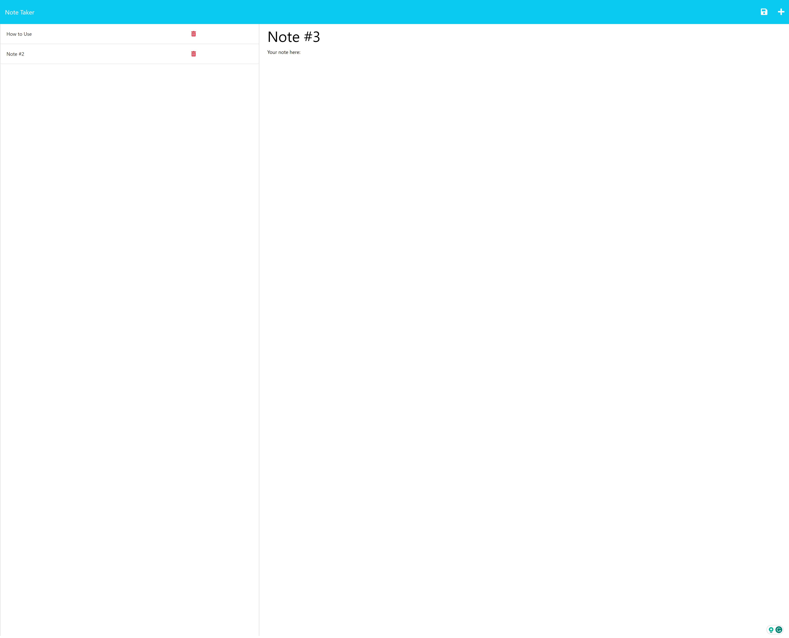

# Note Taker

## Description
The goal with this project was to create an application that can be used to write and save notes. The main focus was developing the back-end, as this is my first project creating a server for an application to run off of. The app is used for storing and retrieving notes, as well as a title for the note. The notes are stored into a database through the use of Express.js. The storing and retrieving of notes is handled through the back-end and displayed onto the front-end for the user to see and utilize.
## Installation
All that is required is a device with access to a web browser and internet.
## Usage
To get started:
- Upon loading the application you will be brought to the homepage.
- Then, click the get started button in the center of the screen to begin.
- Any previously stored notes into the database will be displayed off to the left side of the window. These notes will have a corresponding trash icon button to delete them when desired.
- At any point, you can click on the previously stored notes to pull up the full note on the right side.
- In the top right corner of the window you will see a plus sign button. When clicked, this will clear out the text boxes for a new note to be written.
- The text boxes have placeholders of "Note Title" and "Note Text" when not currently viewing a note, or when starting a new note.
- Fill out both text boxes where the placeholders are to see a save button appear for the note you are currently writing.
- The save button will appear in the top right of the window, but to the left of the new note button.
- The application can be closed and reopened at any point, and the data will persist accurately.

## Live Application
[Click here to be directed to the deployed application]()

### 